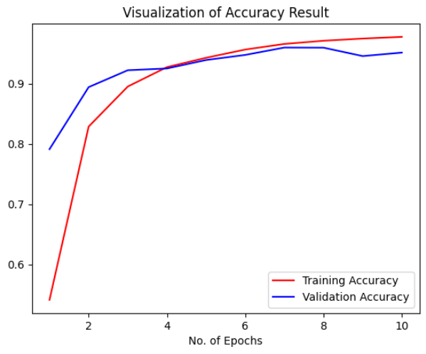
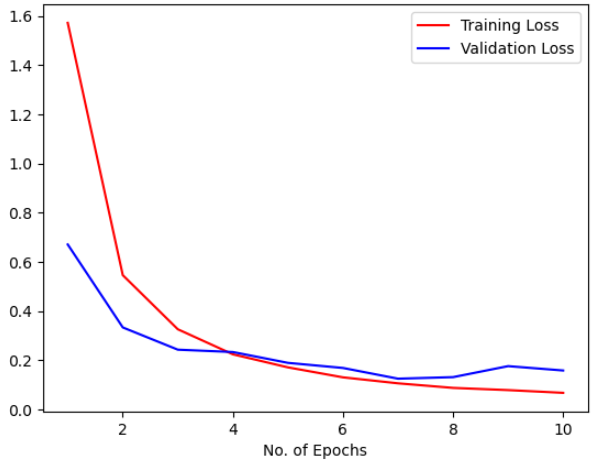

# 🌿 Plant Leaf Diseases Classification using CNN

  

This project aims to classify plant leaf diseases using a Convolutional Neural Network (CNN) trained on the "New Plant Diseases Dataset (Augmented)" from Kaggle. The dataset includes over 87,000 RGB images of healthy and diseased leaves across 38 plant categories.

## 📁 Dataset
- **Source**: [Kaggle - Plant Diseases Dataset](https://www.kaggle.com/datasets/vipoooool/new-plant-diseases-dataset)
- **Classes**: 38 (including healthy and various plant diseases)
- **Image Format**: RGB `.jpg`
- **Size**: ~87k images (Augmented)

## 🧠 Model Architecture
- Convolutional layers with ReLU activation
- MaxPooling layers
- Fully connected Dense layers
- Softmax output for multi-class classification

## 🛠️ Techniques Used
- Data Augmentation
- Dropout Regularization
- Model Evaluation with Accuracy, Loss Curves, and Confusion Matrix

## 📈 Results
The model achieved high accuracy on both training and validation sets, demonstrating good generalization on unseen plant leaf images.

## 🔗 Links

- 📊 [View on Kaggle](https://www.kaggle.com/code/aliamrali/kidney-classification-using-resnet50)
- 🧾 This project is also available on GitHub with full source code and documentation.

## 📷 Project Summary Image

The image below visualizes sample Images, Accuracy, and Loss from the dataset.

  

  

  

